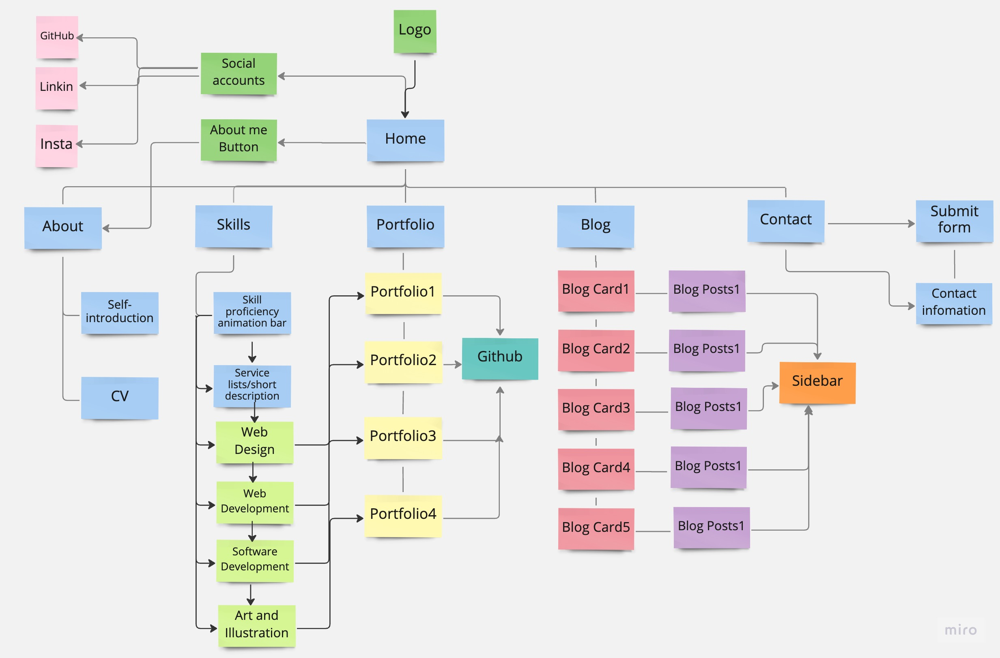

# HelenaRundid - Portfolio

## Overview
This is a portfolio website for displaying my knowledge and skills as a developer and IT professional. 
***
Published portfolio website-[https://6427d168f88833533763ce22--helenarundidportfolio.netlify.app/]
 
GitHub repo-[https://github.com/helenahan37/LUYINGHAN_T1A2]  
Prensentation link- [https://www.youtube.com/watch?v=U0_pQY4pXsg]

### Purpose
The purpose of this website is to showcase my skills, work experience, and personal projects to potential clients, employers, or collaborators. It is a platform for me to establish my personal brand and online presences, which also could help me share my knowledge, insights and ideas with a wider audience through blog posts or other forms of content. 
***

### Target Audience
The target audience for this website may vary, including potential employers seeking a developer, individuals and businesses in need of technical support or custom software solutions. Small business owners looking to establish their online presence with a website or blog, or those requiring an e-commerce platform could also be potential clients. Additionally, individuals or companies with mobile app ideas may seek a personal developer's services as well.

***
 ### Tech stack

 - html
 - CSS
 - Scss
 - JavaScript
 - GitHub
 - Netlify
***
### Functionality / Features

This website has responsive design, which the layout of the webpage will change accordingly based on the screen size of the device being used. 

It also includes some visual design, like image, hover, transform, animation effects, external fonts and icons, etc. to enhance visual appeal and user experience.

The overall color scheme for the website was chosen as pastel macaron color palette, which have following advantages:
1. Can effectively highlight the text content on the website
2. Creates a relaxed and pleasant atmosphere 
3. Easier for users to focus on the content of the website
4. Trendy and modern

#### Here are some components that this website is using:
---
#### Text Components list:
##### Website title:
- Enables users quickly understand the content of the page and improve search engine ranking
- Using "I" to help me separate my name and page name
- A favicon to help me reinforce my brand recognition and make it easier for users to identify and access the site

 

 ##### Navigation bar: 
  - Enables user to easily browse and navigate to different pages of the website. 
  - When users hover over the corresponding text, the text color will change. This effect can help users to draw attention to the element and provide visual feedback.
 

  #### Hamburger menu: 
  - Used to save space on the user interface and simplify navigation on medium and small size screens. 
  - When the screen size reaches a certain point, the navigation bar will become a dropdown hamburger menu and the color of the menu will change. The dropdown menu can make user easier to navigate through the website on smaller screens which leads to a better user experience and improved aesthetics, also increased functionality. 
   

#### Introduction component:
- Designed to display my personal information
- It includes three parts 
  - hitext: used to display a greeting that includes an emoji and text content, welcoming the user
  - name: used to display my name
  - job: used to display my profession, including a text description and a highlighted keyword that emphasizes my expertise.
   

#### Description component:
- Used to display my experience as a web developer
- It includes three parts;
    - job title, including a text description and a highlighted keyword that emphasizes my expertise
    - a brief description of my skills 
    - a brief description of my working experience
     

#### Blog post component: 
  - Provides articles on topics related to the industry and theme
  - It includes a title, date, main content and relevant images, which is used to present written content in a structured and visually appealing way, and make it easier for users to read and engage with the content.

#### Sidebar: 
- Contents recent posts and provide quick access to other blog posts. 
- It with the title and publication date of the post, and a short snippet of the post's content. 
    - The component also includes a call-to-action "Learn More" button that links to the full blog post. When the user hovers over the sidebar, a hover effect is triggered to make a larger scale of the image and indicate that there is a clickable link available. 
    - Add a linear gradient background to enhance visual appeal
    - The purpose of this component is to provide a quick and convenient way for users to preview and access the website's blog content, which can increase user engagement

  
#### Submit form: 
- Allows users to leave messages and comments on the website's content and services. 
- This component is composed of input fields with placeholders that provide clear guidance for users to input their name, email, subject, and messages. 
- A submit button where the color will change when user hovers over it. In addition, an icon with accompanying text has been included to make the messages prompt more engaging and fun for users. 
- A visually attractive background has been applied to set this component apart from other page elements, improving the user experience and emphasizing the importance of the content within this section.

#### Contact information
- It includes text, images, and my contact information. 
- The contact information has a hover effects, where the link changes color when users hover on it
    - Customers can directly click the links to email me or make a call，which can increase user experience
    - I also added a background color to this section to differentiate it from the adjacent submit form

#### Footer
- Containing copyright notice about my company
- Used to provide important copyright information for website visitors
    - It has been fixed on the bottom of website
    - Changed the background color, text color to ensure it is clear visible and distinguish it from other parts of the website

  
***

#### Graphic components list:

#### Logo 
- Used to present my brand identity
- The color of this logo is the same as the navigation bar, in order to achieve color consistency
    - The name of our company is also included below the icon which reinforce the brand identity
    - It links with my home page, when users hover it, the image will transform a larger scale and show it can be clicked

    

#### Social accounts' buttons
- It displays icons for GitHub, LinkedIn, and Instagram, and allows users to click on them to navigate to my social media pages. 
- Used to provide links to my social media profiles, stay updated on my latest news, events, and promotions
- I have made the links appear as icons and changed the icon color when the user hovers over them, which provide visual feedback to the user, indicating that the icon is clickable and highlighting its interactive nature.
    - Using icons can help to improve the aesthetic appeal of a website
    - it can encourage users to click on the icons and increase user engagement

#### About me button
- This button provides a link to the "About Me" page on the website. When users hover over the button, the color changes, indicating that it is clickable and providing visual feedback to the user. 
    - This can help to improve the user experience by making the button's interactive nature more apparent
    - encouraging users to click through to the "About Me" page

    

#### Download button 
- This button contains a link to my personal resume file. When users hover over the button, the color will change, providing visual feedback that the link is clickable and interactive. 
    - This can help to improve the user experience by making the link's functionality more apparent
    - Encouraging users to click through to access my resume file
    - The button's style is consistent with that of the "About Me" button, creating a cohesive visual design across the website. This can help to improve the overall aesthetic appeal of the site and provide a sense of unity and consistency to the user experience.

    
#### skills animated progress bar
- Includes my level of proficiency in various skills, making it easier for users to understand my capabilities
- Each skill name is clickable, and when users hover over these names, they will change color, indicating that they are clickable. 
- Each of these skills corresponds to a project on my GitHub account，making it easier for them to access and view my work

#### Service component
- I replaced the progress bars with corresponding images on a smaller screen size, and added text descriptions below each skill and service to make it easier for users to read. 
- Both the images and text are set as clickable links, allowing users to navigate by clicking anywhere on the skill or service. This improves the user experience and usability

#### Portfolio cards
- I designed the portfolios in the form of cards, and added a hover effect that enlarges the image to indicate to users that they are clickable
- In this component, I used pseudo-elements to display project names and link icons on tablet size screens, and only display links on smaller screens. This enhances the usability of the component across different screen sizes. On medium and small size screens, the icons become transparent when users hover over them, adding some fun to the component

#### Blog cards 
- I designed my blog page in the form of cards as well, to maintain a consistent style with my portfolio page
- I also added a hover effect that enlarges the cards to indicate to users that they are clickable
- I added a gradient background to enhance the visual appeal of the cards

  ***

### Sitemap

This website consists of six pages: home page, about page, skills page, portfolio page, blog page, and contact page. The blog page also includes an additional five separate blog post pages. 

The home page serves as the main page of the website and is connected to the other five pages. It contains icons for my personal social accounts, each of which links to my corresponding account. The logo in the header also links back to the home page, allowing users to easily return to the main page from any other page. It also includes an "about me" button that leads to my about page. 

The about page provides a brief introduction of myself and includes a button to access my personal resume file. 

The skills page includes animated progress bars that display my proficiency in various skills, it can be treated as a list of projects that I offer my services for. Each service in the progress bar is a separate link that corresponds to an independent project on my portfolio page.

The portfolio page features four separate projects, each of which links to my corresponding Github project. 

The blog page includes five separate blog cards, each with its own separate blog post. Each blog post also includes a sidebar that allows users to view the latest blog posts and navigate to each individual blog's main page.

The contact page provides my detailed contact information and a submit form for users to contact me and ask me questions.

***

### Screenshot
#### Home Page

Desktop Size:

Aligning images and text horizontally
- it creates a clear and easy-to-follow visual hierarchy. By placing the image and text side by side, it allows the reader to quickly and intuitively understand the relationship between the two elements. This layout is also more visually appealing and can make the content appear more organized and professional. This layout can create a balanced and visually appealing design, while also being user-friendly and easy to navigate.

Compactly arranging all buttons
- it saves page space and makes the page more tidy and easy to navigate, creating a clean, uncluttered layout
- By placing related buttons together, users can quickly identify and select the options they need.  

Highlighting keywords
- draw the reader's attention to the most important information on the page and add visual interest to my website and make it more engaging for users.

Tablet Size:

The navigation bar becomes to hamburger menu in order to save space and enhance user experience.

- Centering images and text vertically
    - creates a cohesive and balanced layout that is both aesthetically pleasing and functional.

- Arranging buttons side by side 
    - improved visual organization, easier navigation, and increased efficiency. 

Phone Size:

Placing the "About Me" button on the bottom of the page and clearly separate it from other buttons
#### About Page

Desktop size:

Keeping layout consistent with the homepage, put the image on one side and put other texts on another side
- it enhances the overall user experience and helps visitors to navigate the website more easily. When the layout is consistent, users can quickly find the information they are looking for, without having to re-learn how to navigate the website on each page.

Tablet size:

Keeping layout consistent with homepage, centering images and texts content vertically.

Phone size:

- Using CSS grid to help me rearrange the text content’s position, make it overlap with my main image.  
- Adding a white background to the text section
  - it can create contrast between the background color and the text color which can make the information more prominent.
#### Skills Page

Desktop Size:

Using colorful animated progress bar to showcase my skills and services that I have provided.
   - Progress bars are visually appealing and can grab the attention of users, making it easier for them to navigate through my website or portfolio.
   - it can provide a quick and easy way for viewers to understand my skills level which can help impress potential clients or employers.

Table Size:

Keeping consistent layout with previous pages, making layout tidy and uncluttered. Also increase user experience.

Phone Size:

Changing the skill progress bar to display images with text below them 
 - make it easier for users on small mobile devices to read
 - add visual interest to my website

#### Portfolio Page

Desktop Size:

Design my portfolio images as cards
- making them easier for viewers to see the details of my project. By showcasing images of my projects, I can give viewers a better sense of what the final product looks like and make a stronger impression on them.

Table Size:

Stretched the picture to occupy more space, and added the specific names of each project and a link icon below 
- it provides the added benefit of easily identifying and linking to related content.

Phone Size:

Get rid of the project name
- including the project name in the image can make it appear crowded or cluttered on smaller size of screens
- keeping only one image link in an image on mobile devices can make it more visually appealing and easier to navigate for users

#### Blog Page

Desktop Size:

Designed blog as blog card 
- keeping consistent layout with the portfolio design
- Blog cards are optimized for click-through rates by providing a clear title and date of my blog also with an image. This can entice users to click through to my blog and read the full article.

Tablet Size:

Displayed them in two rows to give them more space 
- images are less crowed, making it easier for users to read and understand the content
- provide a more organized and visually appealing layout that can catch the user's attention and entice them to engage with the content

Phone Size:

Displaying the content vertically while maintaining consistency with the portfolio page. 
Enhance the user experience on smaller screens.

#### Blog posts

Desktop Size:

Each blog post has a sidebar with a brief description, image, title and date of the blog, making it easier for visitors to navigate through existing blog posts
- enhance the user experience by making it easier for visitors to navigate my blog and find what they are looking for
- learn more button here can also promote engagement

Table and phone Size:
Sidebar will be moved to the bottom of the screen for ease of use by the users

#### Contact Page

Desktop Size:

Using different background colors
- Create a clear visual hierarchy between the informational content and the forms. 
- Makes it easier for users to distinguish between the two and find what they're looking for quickly.
- Create a balanced and aesthetically pleasing layout

Tablet Size:

Centering texts and images vertically- keeping consistent layout with the previous' page design

Phone Size:

Replacing a regular image with a background image
- create a more visually appealing and immersive experience for the user
- can be adjusted to fit different screen sizes and resolutions, and can be resized and repositioned to accommodate different content layouts.

***

    
    

   

    

    

    

  

    

    

